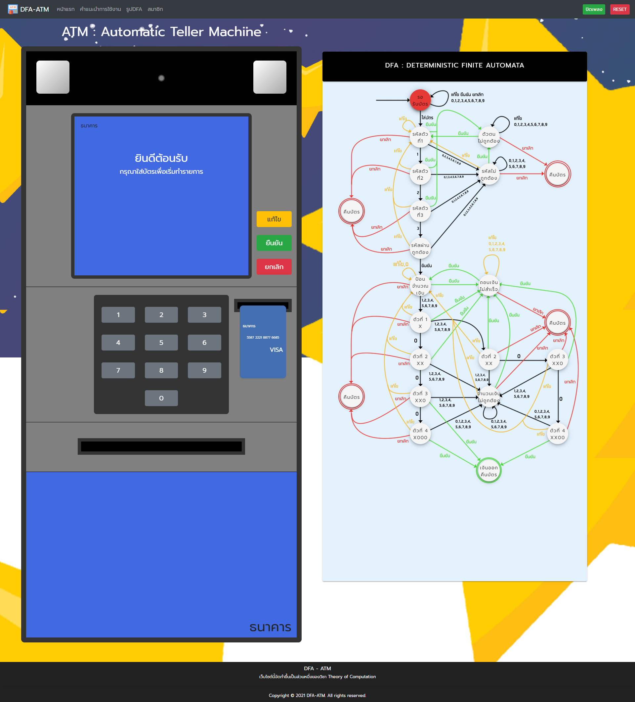

# atm-vue

Webcam feature will work when it's HTTPS or locally !!!!

Site Product : https://dfa-atm.web.app/



## Project setup
```
npm install
```

### Compiles and hot-reloads for development
```
npm run serve
```

### Compiles and minifies for production
```
npm run build
```

### Customize configuration
See [Configuration Reference](https://cli.vuejs.org/config/).
